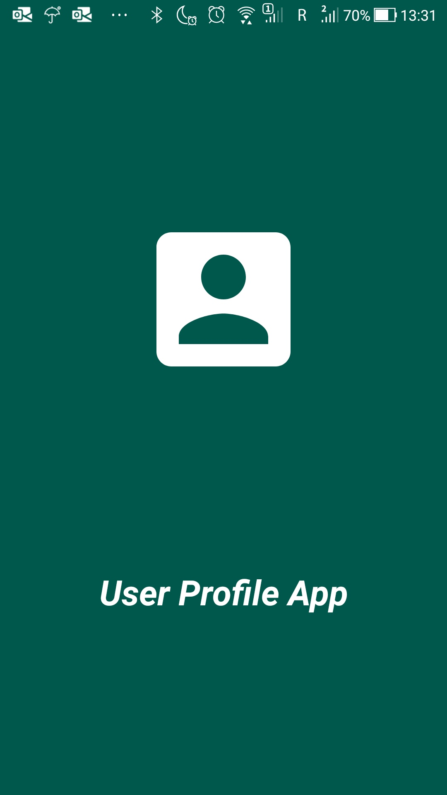
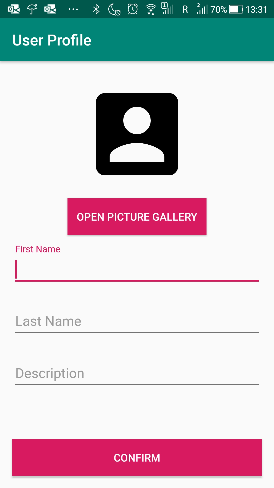
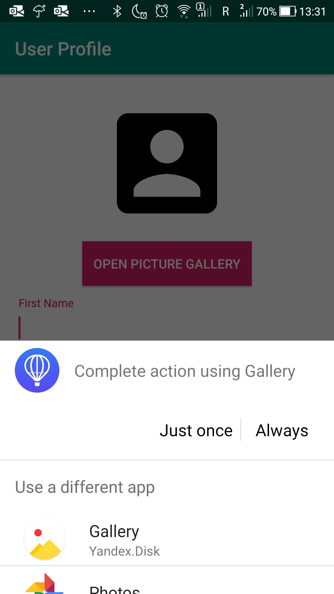
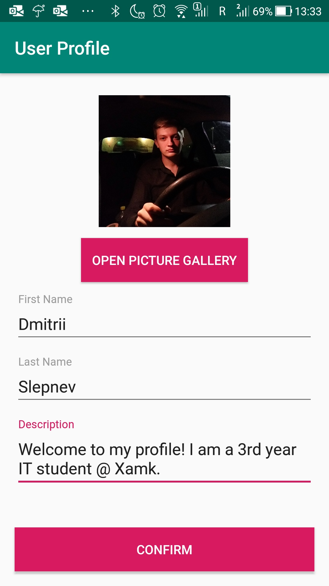

# Level 3 Learning Task 1 - User Profile App
This is the first learning task of the third level. This task was a bit more challenging but still pretty easy to implement since there is a detailed tutorial on how to do everything.
## What's inside
This is a user profile app in which the user can create a profile with his/her name, a description and a profile picture which can be selected from the image gallery on the user’s phone. The app also has a splash screen.
I've practiced opening and closing activities using intents and exchanging information between activities using parcelables.
## Screenshots
    
    

